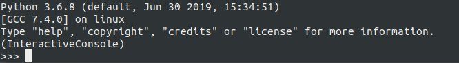

# db-hack

Скрипт позволяет делать со школьным дневником учащегося следующее:
1. Изменять плохие оценки на отличные.
2. Удалять замечания из дневника.
3. Добавлять хорошие замечания от учителя.

## Установка

Если вы являетесь разработчиком, то сначала вам надо запустить сайт школьного дневника из [репозитория](https://github.com/devmanorg/e-diary/tree/master).

После установки или в случае если дневник уже установлен нужно скачать файл `scripts.py`  положить его в одну директорию с файлом `manage.py`.
После чего запустить из командной строки интерактивную оболочку Django путём введения в командную строку, находясь в корневой директории приложения дневника, команду `python manage.py shell`. Должна запуститься интерактивная оболчка Django как на рисунке.

Для подключения скрипта нужно ввести в строку `from scripts import create commendation, fix_marks, remove_chastisements` и нажать Enter.

## Описание работы методов

### Метод fix_marks

Метод позволяет исправить все плохие оценки на пятёрки. Пример запуска метода `fix_marks('Фролов Иван')`.

### Метод remove_chastisements

Метод удаляет все замечания из дневника ученика. Пример запуска метода `remove_chastisements('Фролов Иван')`.

### Метод create_commendation

Метод проставляет положительный комментарий от учителя в дневник по указанной дисциплине. Пример запуска `create_commendation('Фролов Иван', 'Русский язык')`.

## Цель проекта

Код написан в образовательных целях на онлайн-курсе для веб-разработчиков [dvmn.org](https://dvmn.org/).